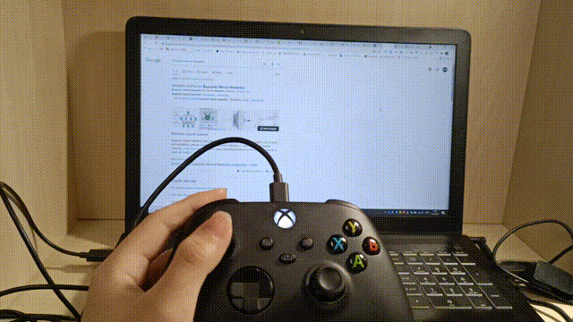

# Chrome Plugin for Xbox Controller

Chrome Plugin for Xbox Controller 允许你使用 Xbox Controller 进行一系列 Chrome 操作（Scroll、切换或关闭标签页等）。

## Demo

## 功能

| 键位         | 功能               |
| ------------ | ------------------ |
| LB（左肩键） | 切换到上一个标签页 |
| RB（右肩键） | 切换到下一个标签页 |
| 左摇杆       | 滑动页面           |
| X            | 关闭当前页面       |

## Issues/PRs

由于本人只有 Xbox 手柄一款控制器，故目前暂不考虑做多手柄适配，也不接受相关 Issues/PRs。您可以自行 fork 并开发支持多个控制器的版本。
